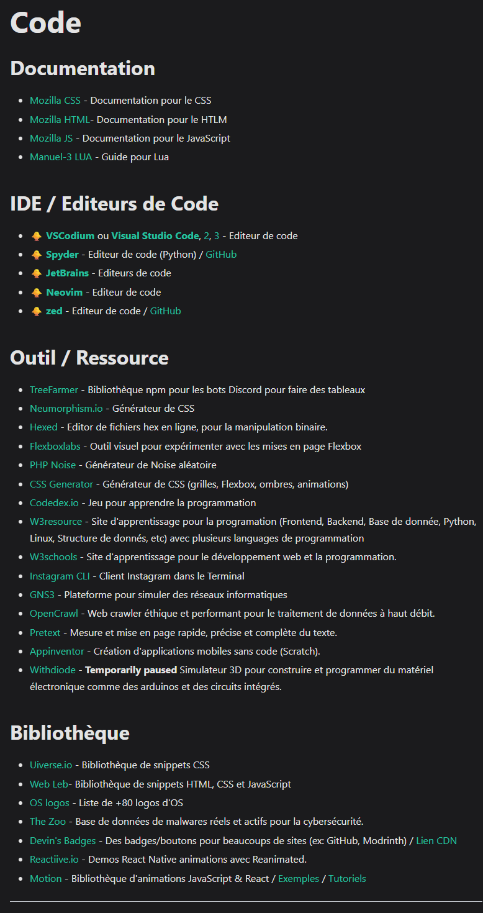

## Wiki Updates

Here's a list of the recent changes we've made  :

- Added new subsection for **[IDE / Code Editors](/docs/FR/Catégories/code#ide--editeurs-de-code)**
- Modified the descriptions of the following links :
  - [Manuel-3 LUA](https://manuel-3.github.io/lua-quickstart/)
  - [TreeFarmer](https://github.com/TreeFarmer/embed-table)
  - [Neumorphism.io](https://neumorphism.io/)
  - [Hexed](https://hexed.it/)
  - [Flexboxlabs](https://flexboxlabs.netlify.app/)
  - [PHP Noise](https://php-noise.com/)
  - [CSS Generator](https://cssgenerator.dev/)
  - [Codedex.io](https://www.codedex.io/)
  - [W3resource](https://www.w3resource.com/)
  - [Instagram CLI](https://github.com/supreme-gg-gg/instagram-cli)
  - [Uiverse.io](https://uiverse.io/)
  - [Web Leb](https://www.web-leb.com/)
  - [OS logos](https://github.com/ngeenx/operating-system-logos)
  - [Devin's Badges](https://intergrav.github.io/devins-badges-docs/badges/)
  - [Motion](https://motion.dev/)

## Stars Added 🐥
- Starred [VSCodium](https://vscodium.com/) in [Coding](/docs/FR/Catégories/code#ide--editeurs-de-code)
- Starred [Visual Studio Code](https://code.visualstudio.com/), [2](https://vscode.dev/), [3](https://cs50.dev/) in [Coding](/docs/FR/Catégories/code#ide--editeurs-de-code)
- Starred [Spyder](https://www.spyder-ide.org/) in [Coding](/docs/FR/Catégories/code#ide--editeurs-de-code)
- Starred [JetBrains](https://jetbrains.com/) in [Coding](/docs/FR/Catégories/code#ide--editeurs-de-code)
- Starred [Neovim](https://neovim.io/) in [Coding](/docs/FR/Catégories/code#ide--editeurs-de-code)
- Starred [zed](https://zed.dev/) in [Coding](/docs/FR/Catégories/code#ide--editeurs-de-code)

{/* truncate */}

## Previews

